# Environment Variable and Set-UID Program Lab

> Author: L1B0

## Task1: Manipulating Environment Variables

### 1. printenv or env

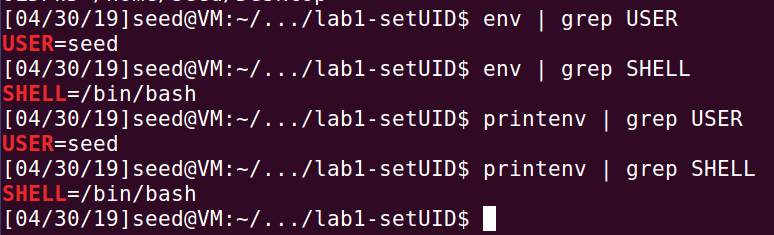

### 2. export and unset

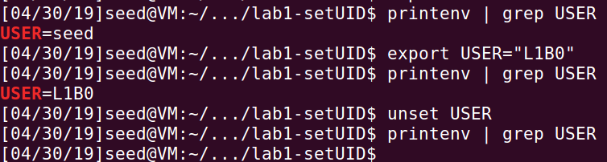

## Task2: Passing Environment Variables from Parent Process to Child Process

### 1. compile and run

```shell
gcc task2.c -o task2
./task2 > output
cat output
```

运行结果如下

```
XDG_VTNR=7
XDG_SESSION_ID=c1
XDG_GREETER_DATA_DIR=/var/lib/lightdm-data/seed
CLUTTER_IM_MODULE=xim
SESSION=ubuntu
ANDROID_HOME=/home/seed/android/android-sdk-linux
GPG_AGENT_INFO=/home/seed/.gnupg/S.gpg-agent:0:1
TERM=xterm-256color
VTE_VERSION=4205
XDG_MENU_PREFIX=gnome-
SHELL=/bin/bash
DERBY_HOME=/usr/lib/jvm/java-8-oracle/db
QT_LINUX_ACCESSIBILITY_ALWAYS_ON=1
LD_PRELOAD=/home/seed/lib/boost/libboost_program_options.so.1.64.0:/home/seed/lib/boost/libboost_filesystem.so.1.64.0:/home/seed/lib/boost/libboost_system.so.1.64.0
WINDOWID=54525962
OLDPWD=/home/seed/Desktop
UPSTART_SESSION=unix:abstract=/com/ubuntu/upstart-session/1000/2114
GNOME_KEYRING_CONTROL=
GTK_MODULES=gail:atk-bridge:unity-gtk-module
LS_COLORS=rs=0:di=01;34:ln=01;36:mh=00:pi=40;33:so=01;35:do=01;35:bd=40;33;01:cd=40;33;01:or=40;31;01:mi=00:su=37;41:sg=30;43:ca=30;41:tw=30;42:ow=34;42:st=37;44:ex=01;32:*.tar=01;31:*.tgz=01;31:*.arc=01;31:*.arj=01;31:*.taz=01;31:*.lha=01;31:*.lz4=01;31:*.lzh=01;31:*.lzma=01;31:*.tlz=01;31:*.txz=01;31:*.tzo=01;31:*.t7z=01;31:*.zip=01;31:*.z=01;31:*.Z=01;31:*.dz=01;31:*.gz=01;31:*.lrz=01;31:*.lz=01;31:*.lzo=01;31:*.xz=01;31:*.bz2=01;31:*.bz=01;31:*.tbz=01;31:*.tbz2=01;31:*.tz=01;31:*.deb=01;31:*.rpm=01;31:*.jar=01;31:*.war=01;31:*.ear=01;31:*.sar=01;31:*.rar=01;31:*.alz=01;31:*.ace=01;31:*.zoo=01;31:*.cpio=01;31:*.7z=01;31:*.rz=01;31:*.cab=01;31:*.jpg=01;35:*.jpeg=01;35:*.gif=01;35:*.bmp=01;35:*.pbm=01;35:*.pgm=01;35:*.ppm=01;35:*.tga=01;35:*.xbm=01;35:*.xpm=01;35:*.tif=01;35:*.tiff=01;35:*.png=01;35:*.svg=01;35:*.svgz=01;35:*.mng=01;35:*.pcx=01;35:*.mov=01;35:*.mpg=01;35:*.mpeg=01;35:*.m2v=01;35:*.mkv=01;35:*.webm=01;35:*.ogm=01;35:*.mp4=01;35:*.m4v=01;35:*.mp4v=01;35:*.vob=01;35:*.qt=01;35:*.nuv=01;35:*.wmv=01;35:*.asf=01;35:*.rm=01;35:*.rmvb=01;35:*.flc=01;35:*.avi=01;35:*.fli=01;35:*.flv=01;35:*.gl=01;35:*.dl=01;35:*.xcf=01;35:*.xwd=01;35:*.yuv=01;35:*.cgm=01;35:*.emf=01;35:*.ogv=01;35:*.ogx=01;35:*.aac=00;36:*.au=00;36:*.flac=00;36:*.m4a=00;36:*.mid=00;36:*.midi=00;36:*.mka=00;36:*.mp3=00;36:*.mpc=00;36:*.ogg=00;36:*.ra=00;36:*.wav=00;36:*.oga=00;36:*.opus=00;36:*.spx=00;36:*.xspf=00;36:
QT_ACCESSIBILITY=1
LD_LIBRARY_PATH=/home/seed/source/boost_1_64_0/stage/lib:/home/seed/source/boost_1_64_0/stage/lib:
XDG_SESSION_PATH=/org/freedesktop/DisplayManager/Session0
XDG_SEAT_PATH=/org/freedesktop/DisplayManager/Seat0
SSH_AUTH_SOCK=/run/user/1000/keyring/ssh
DEFAULTS_PATH=/usr/share/gconf/ubuntu.default.path
SESSION_MANAGER=local/VM:@/tmp/.ICE-unix/2374,unix/VM:/tmp/.ICE-unix/2374
XDG_CONFIG_DIRS=/etc/xdg/xdg-ubuntu:/usr/share/upstart/xdg:/etc/xdg
DESKTOP_SESSION=ubuntu
PATH=/home/seed/bin:/usr/local/sbin:/usr/local/bin:/usr/sbin:/usr/bin:/sbin:/bin:/usr/games:/usr/local/games:.:/snap/bin:/usr/lib/jvm/java-8-oracle/bin:/usr/lib/jvm/java-8-oracle/db/bin:/usr/lib/jvm/java-8-oracle/jre/bin:/home/seed/android/android-sdk-linux/tools:/home/seed/android/android-sdk-linux/platform-tools:/home/seed/android/android-ndk/android-ndk-r8d:/home/seed/.local/bin
QT_IM_MODULE=ibus
QT_QPA_PLATFORMTHEME=appmenu-qt5
XDG_SESSION_TYPE=x11
PWD=/home/seed/Desktop/lab1-setUID
JOB=dbus
XMODIFIERS=@im=ibus
JAVA_HOME=/usr/lib/jvm/java-8-oracle
GNOME_KEYRING_PID=
LANG=en_US.UTF-8
GDM_LANG=en_US
MANDATORY_PATH=/usr/share/gconf/ubuntu.mandatory.path
COMPIZ_CONFIG_PROFILE=ubuntu
IM_CONFIG_PHASE=1
GDMSESSION=ubuntu
SESSIONTYPE=gnome-session
GTK2_MODULES=overlay-scrollbar
SHLVL=1
HOME=/home/seed
XDG_SEAT=seat0
LANGUAGE=en_US
GNOME_DESKTOP_SESSION_ID=this-is-deprecated
XDG_SESSION_DESKTOP=ubuntu
LOGNAME=seed
DBUS_SESSION_BUS_ADDRESS=unix:abstract=/tmp/dbus-cskkO5JDkA
J2SDKDIR=/usr/lib/jvm/java-8-oracle
XDG_DATA_DIRS=/usr/share/ubuntu:/usr/share/gnome:/usr/local/share/:/usr/share/:/var/lib/snapd/desktop
QT4_IM_MODULE=xim
LESSOPEN=| /usr/bin/lesspipe %s
INSTANCE=
XDG_RUNTIME_DIR=/run/user/1000
DISPLAY=:0
XDG_CURRENT_DESKTOP=Unity
GTK_IM_MODULE=ibus
J2REDIR=/usr/lib/jvm/java-8-oracle/jre
LESSCLOSE=/usr/bin/lesspipe %s %s
XAUTHORITY=/home/seed/.Xauthority
_=./task2
```

### 2. 注释掉case 0中的printenv，恢复case 1中的printenv

```shell
gcc task2.c -o task2
./task2 > output2
cat output2
```

### 3. compare the difference between output and output2

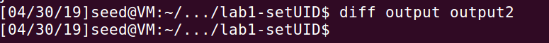

## Task 3: Environment Variables and execve()

### 1. compile and run

```shell
gcc task3.c -o task3
./task3
```

无输出

### 2. 将execve中第三个参数改为environ


### 3. How the new program gets its environment variables?

首先linux中每个程序都有一个环境表，它是一个字符指针数组，其中每个指针包含一个以NULL结尾的C字符串的地址。全局变量**environ**则包含了该指针数组的地址。

**execve**详解如下

>函数原型：
>
>int execve(const char * filename,char * const argv[ ],char * const envp[ ]);
>
>参数介绍：
>
>filename：程序所在的路径
>
>argv：传递给程序的参数，数组指针argv必须以程序(filename)开头，NULL结尾
>
>envp：传递给程序的**新环境变量**，无论是shell脚本，还是可执行文件都可以使用此环境变量，必须以NULL结尾

当执行`execve("/usr/bin/env", argv, NULL)`时，由于envp参数为空，而filename为`/usr/bin/env`，作用就是输出环境变量，故执行无输出。

当执行`execve("/usr/bin/env", argv, environ)`时，envp为全局变量`environ`，即当前程序的环境变量，故执行结果就是输出该程序的所有环境变量。

## Task 4: Environment Variables and system()

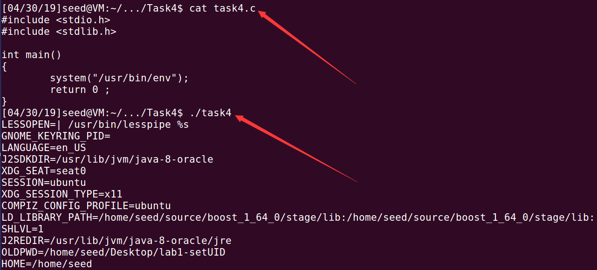

## Task 5: Environment Variable and Set-UID Programs

### 1. compile and chown and chmod

首先编译源码，改变程序的拥有者及设置set-UID

如下，可以看到`task5`拥有s权限，即set-UID。

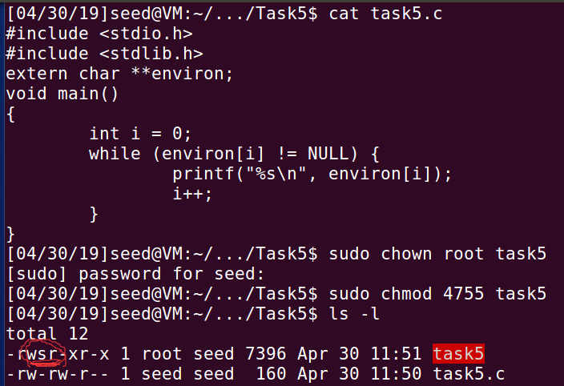

### 2. export

接着使用export改变（添加）环境变量`LD_LIBRARY_PATH`、`L1B0`

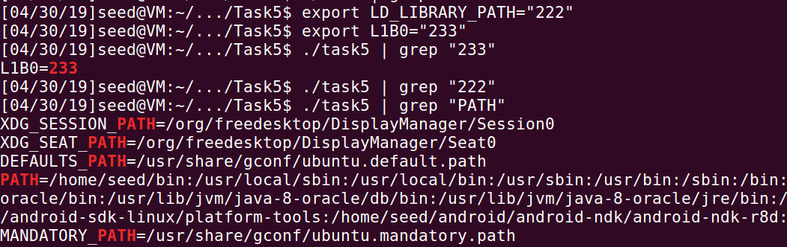

可以看到环境变量`LD_LIBRARY_PATH`没被传入Set-UID子进程。

这是因为出于安全原因，对于已设置set-UID或set-GID的可执行文件，LD_LIBRARY_PATH则被忽略。

## Task 6: The PATH Environment Variable and Set-UID Programs

### 1. compile and chown and chmod

```shell
gcc task6.c  -o task6
sudo chown root task6
sudo chmod 4755 task6
```

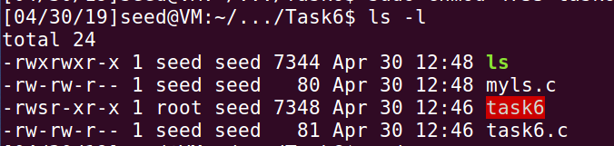

### 2. compile my ls program and export PATH

编写一个自己的程序并编译命名为`ls`，使用export命令在环境变量`PATH`中添加当前路径。

```shell
[04/30/19]seed@VM:~/.../Task6$ cat myls.c 
#include <stdio.h>
#include <stdlib.h>
int main()
{
	system("whoami");
	printf("Oh, it's L1B0's ls!\n");
	return 0;
}
[04/30/19]seed@VM:~/.../Task6$ gcc myls.c -o ls
[04/30/19]seed@VM:~/.../Task6$ export PATH='/home/seed/Desktop/lab1-setUID/Task6':$PATH
[04/30/19]seed@VM:~/.../Task6$ ./task6 
seed
Oh, it's L1B0's ls!
[04/30/19]seed@VM:~/.../Task6$ sudo rm /bin/sh
[04/30/19]seed@VM:~/.../Task6$ sudo ln -s /bin/zsh /bin/sh
[04/30/19]seed@VM:~/.../Task6$ ./task6 
root
Oh, it's L1B0's ls!
```

结果如上，可以看到原本的ls已经被链接至我自定义的ls。

`myls.c`中我使用`system("whoami")`来检测运行该程序时用户是否为root。

当直接运行task6时，用户为`seed`，这是因为`ubuntu 16`有检测机制，当运行有set-UID权限的程序时，将程序权限降至原来的用户权限；

当使用zsh时，可以看到结果为`root`，表示是以root执行该程序的。

## Task 7: The LD_PRELOAD Environment Variable and Set-UID Programs

### 1. compile and LD_PRELOAD

```shell
gcc -fPIC -g -c mylib.c
gcc -shared -o libmylib.so.1.0.1 mylib.o -lc
gcc myprog.c -o myprog
export LD_PRELOAD=./libmylib.so.1.0.1
```

### 2. run in different environments

* Make myprog a regular program, and run it as a normal user.

```shell
[04/30/19]seed@VM:~/.../Task7$ ./myprog 
I am not sleeping!
```

* Make myprog a Set-UID root program, and run it as a normal user.

```shell
[04/30/19]seed@VM:~/.../Task7$ sudo chmod 4755 myprog
[sudo] password for seed:
[04/30/19]seed@VM:~/.../Task7$ sudo chown root myprog
[04/30/19]seed@VM:~/.../Task7$ ./myprog 
[04/30/19]seed@VM:~/.../Task7$ 
```

* Make myprog a Set-UID root program, export the LD_PRELOAD environment variable again in the root account and run it.

```shell
[04/30/19]seed@VM:~/.../Task7$ su
Password: 
root@VM:/home/seed/Desktop/lab1-setUID/Task7# export LD_PRELOAD=./libmylib.so.1.0.1
root@VM:/home/seed/Desktop/lab1-setUID/Task7# ./myprog 
I am not sleeping!
```

* Make myprog a Set-UID user1 program (i.e., the owner is user1, which is another user account), export the LD_PRELOAD environment variable again in a different user’s account (not-root user) and run it.

```shell
[04/30/19]seed@VM:~/.../Task7$ sudo chown user1 myprog
[04/30/19]seed@VM:~/.../Task7$ ls -l
total 28
-rwxrwxr-x 1 seed  seed 7940 Apr 30 13:23 libmylib.so.1.0.1
-rw-rw-r-- 1 seed  seed  151 Apr 30 13:21 mylib.c
-rw-rw-r-- 1 seed  seed 2600 Apr 30 13:22 mylib.o
-rwxr-xr-x 1 user1 seed 7348 Apr 30 13:35 myprog
-rw-rw-r-- 1 seed  seed   57 Apr 30 13:24 myprog.c
[04/30/19]seed@VM:~/.../Task7$ su user1
Password: 
user1@VM:/home/seed/Desktop/lab1-setUID/Task7$ ./myprog 
user1@VM:/home/seed/Desktop/lab1-setUID/Task7$ export LD_PRELOAD=./libmylib.so.1.0.1
user1@VM:/home/seed/Desktop/lab1-setUID/Task7$ ./myprog 
I am not sleeping!
```

### 3. The reasons of that

第一种情况下，LD_PRELOAD是生效的，因为是在当前用户LD_PRELOAD，当前用户下执行程序。

第二种情况下，LD_PRELOAD失效，因为程序有set-UID，运行时是以root权限，此状态下LD_PRELOAD无法被继承。

第三种情况下，LD_PRELOAD生效，是因为在root用户下执行`export`，并在root用户下执行程序。

第四种情况下，LD_PRELOAD生效，与第二，三种情况类似，在user1用户下执行`export`，并在user1用户下执行程序。

## Task 8: Invoking External Programs Using system() versus execve()

### 1. system

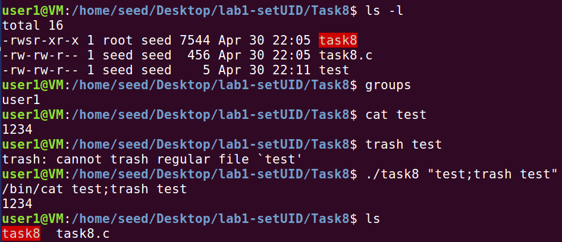

文件`test`是在用户`seed`下创建的，可以看到`user1`和`seed`是不同的属组，故用户`user1`对文件`test`只有读权限。

在此基础上，执行命令`./task8 "test;trash test"`达到删除不可写的文件的目的。

### 2. execve

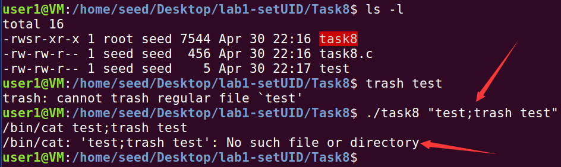

可以看到，当使用execve函数时，原本的命令执行失败，这是因为在execve中，命令与数据是严格分离的。当我们输入`./task8 "test;trash test"`时，代表`cat `文件`test;trash test`。

而对于system函数来说，用户的输入即命令，当我们输入`./task8 "test;trash test"`时，代表执行`cat test;trash test`。相当于先输出文件test的内容，再将文件test放入回收站。

## Task 9: Capability Leaking

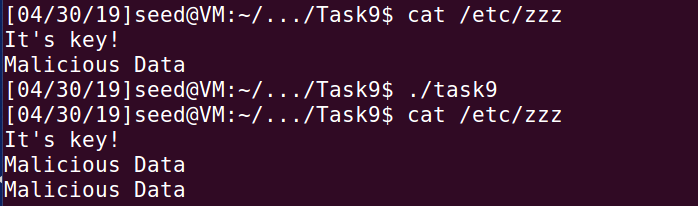

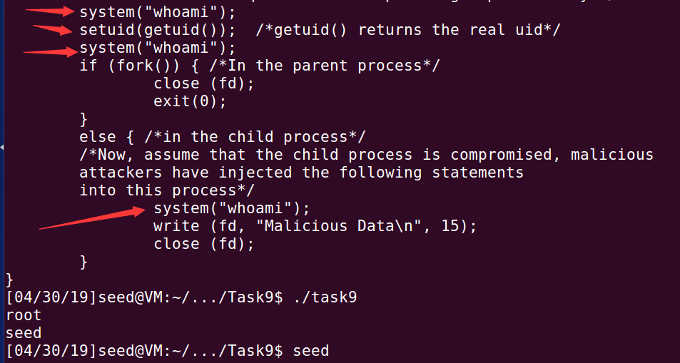

可以看到，尽管在用户权限由root降至原本的用户，在拥有资源描述符fd的情况下，还是可以对文件进行写操作（修改）。
