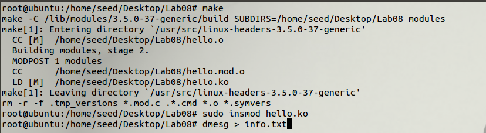
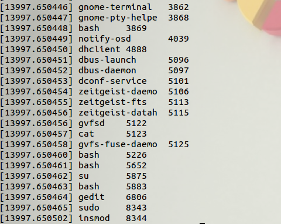
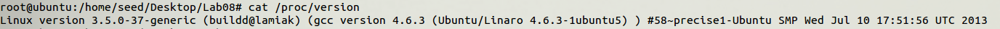
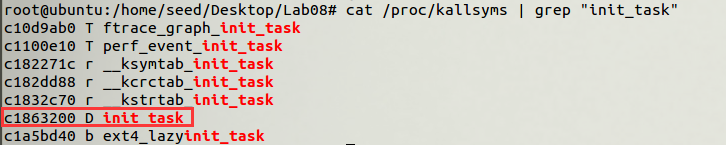
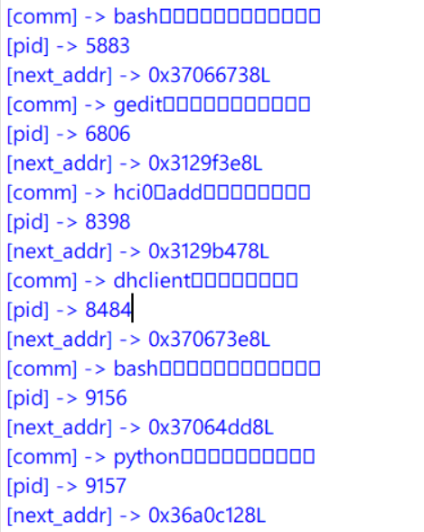

# Direct Kernel Object Manipulation

> 1120162015 李博

## Task1: 在虚拟机内部加载内核模块输出进程信息

hello.c代码如下

首先获取`init_task`地址，它是kernel中的第一个进程，以此遍历进程控制块链表，获取进程信息。

```c
#include <linux/init.h>
#include <linux/module.h>
#include <linux/kernel.h>
#include <linux/sched.h>
#include <linux/init_task.h>
// 初始化函数
static int hello_init(void)
{
    struct task_struct *p;
    p = NULL;
    p = &init_task;
    for_each_process(p)
    {
        if(p->mm != NULL){ // 输出非内核线程
            printk(KERN_ALERT"%s\t%d\n",p->comm,p->pid);
        }
    }
    return 0;
}
// 清理函数
static void hello_exit(void)
{
    printk(KERN_ALERT"goodbye!\n");
}

// 函数注册
module_init(hello_init);  
module_exit(hello_exit);
```

Makefile内容如下

```makefile
ifneq	($(KERNELRELEASE),)
obj-m	:= hello.o 

else
KDIR	:= /lib/modules/$(shell uname -r)/build
PWD	:= $(shell pwd)
default:	
	$(MAKE) -C $(KDIR) SUBDIRS=$(PWD) modules 
	rm -r -f .tmp_versions *.mod.c .*.cmd *.o *.symvers 

endif
```

执行以下命令，将`hello.c`编译，并将生成的`hello.ko`加载进模块。



结果部分如下图，可以看到成功将进程信息打印出来，包括进程的comm（名字等）和pid（进程号）。




## Task2: 分析虚拟机的内存镜像，输出进程信息

这里我使用的是虚拟机是ubuntu12.04，查看其内核版本如下，为`3.5.0-37-generic`。



### Step1: 获取init_task的虚拟地址

在linux中`/proc/kallsyms`存储内核符号表，故在该文件中可以找到`init_task`的虚拟地址，如下为`c1863200`。



由于这是32位系统，故`0xc1863200-0xc0000000=0x01863200`为物理地址。

至此拿到了0号进程的地址，可以获取到它的进程控制块信息，但还需要知道task_struct结构体中各元素的偏移。

### Step2: 获取PCB中各元素的偏移

通过`offsetof`函数寻找结构体`task_struct`中各元素的偏移，c源码如下。

```c
#include <linux/init.h>
#include <linux/module.h>
#include <linux/kernel.h>
#include <linux/sched.h>
#include <linux/init_task.h>
// 初始化函数
static int hello_init(void)
{
    struct task_struct *p;
    p = &init_task;
    
    printk(KERN_ALERT"****************My result*****************\n");
    printk(KERN_ALERT"pid_size: %d\n",sizeof(p->pid));
    printk(KERN_ALERT"comm_size: %d\n",sizeof(p->comm));
    printk(KERN_ALERT"tasks_size: %d\n",sizeof(p->tasks));
    printk(KERN_ALERT"tasks_value: %x\n",p->tasks);
    
    printk(KERN_ALERT"pid_offset: %d\n",offsetof(struct task_struct,pid));
    printk(KERN_ALERT"comm_offset: %d\n",offsetof(struct task_struct,comm));
    printk(KERN_ALERT"tasks_offset: %d\n",offsetof(struct task_struct,tasks));
    return 0;
}
// 清理函数
static void hello_exit(void)
{
    printk(KERN_ALERT"goodbye!\n");
}

// 函数注册
module_init(hello_init);  
module_exit(hello_exit);
```

Makefile和task1的Makefile一致，编译后结果如下。

```shell
[20967.105828] ****************My result*****************
[20967.105831] pid_size: 4
[20967.105832] comm_size: 16
[20967.105832] tasks_size: 8
[20967.105833] tasks_value: f4ca81b8
[20967.105834] pid_offset: 520
[20967.105835] comm_offset: 740
[20967.105836] tasks_offset: 440
```

可以看到`pid`、`comm`、`tasks`三个元素的大小及偏移被打印出来。

### Step3: 获取内存镜像中所有进程信息

由第一步得到的**0号进程物理地址**及第二步得到的**PCB各元素偏移**，可编写python脚本如下

```python
#!/usr/bin/python

def u32(s):
        return eval('0x'+s[::-1].encode('hex'))

f = open("./Ubuntu-6c5f5ff8.vmem",'rb')

# 固定大小
pid_size = 4
comm_size = 16
tasks_size = 8

# 固定偏移
pid_offset = 520
comm_offset = 740
tasks_offset = 440

# 0号进程的物理地址
init_task_addr = 0x01863200

#1. read init_task
f.seek(init_task_addr+tasks_offset,0)
next_addr = u32(f.read(4)) - 0xc0000000
print hex(next_addr)

f.seek(init_task_addr+pid_offset,0)
pid = u32(f.read(4))
print hex(pid)

f.seek(init_task_addr+comm_offset,0)
comm = f.read(16)
print comm

# 2. read all proc info
first_comm = comm # 记录第一个进程的comm
while(1):
        f.seek(next_addr+comm_offset-tasks_offset,0)
        comm = f.read(16)
        # 双向链表到达结尾，结束
        if comm == first_comm:
                break
        print "[comm] -> {}".format(comm)
        
        f.seek(next_addr+pid_offset-tasks_offset,0)
        pid = u32(f.read(4))
        print "[pid] -> {}".format(pid)

        f.seek(next_addr,0)
        next_addr = u32(f.read(4)) - 0xc0000000
        print "[next_addr] -> {}".format(hex(next_addr))
```

结果部分截图如下

